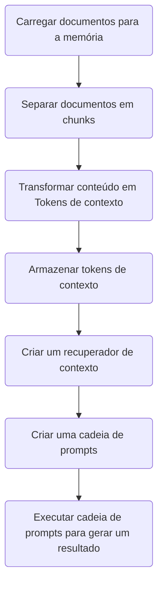

```mermaid
graph TD;
    A(Carregar documentos para a memória) --> B(Separar documentos em chunks);
    B --> C(Transformar conteúdo em Tokens de contexto);
    C --> D(Armazenar tokens de contexto);
    D --> E(Criar um recuperador de contexto);
    E --> F(Criar uma cadeia de prompts);
    F --> G(Executar cadeia de prompts para gerar um resultado);
```

